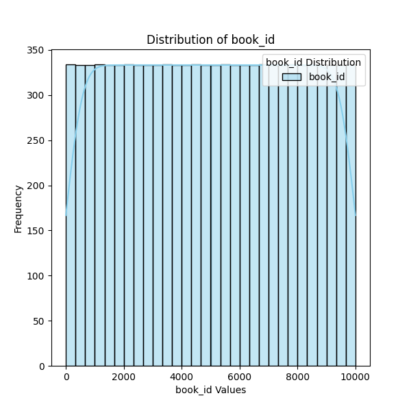
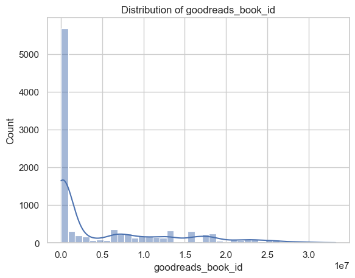

# Automated Data Analysis Report

## Dataset Summary
The dataset contains 10000 rows and 23 columns.

### Column Details:
- **book_id** (int64): Example values: [1, 2, 3, 4, 5]
- **goodreads_book_id** (int64): Example values: [2767052, 3, 41865, 2657, 4671]
- **best_book_id** (int64): Example values: [2767052, 3, 41865, 2657, 4671]
- **work_id** (int64): Example values: [2792775, 4640799, 3212258, 3275794, 245494]
- **books_count** (int64): Example values: [272, 491, 226, 487, 1356]
- **isbn** (object): Example values: ['439023483', '439554934', '316015849', '61120081', '743273567']
- **isbn13** (float64): Example values: [9780439023480.0, 9780439554930.0, 9780316015840.0, 9780061120080.0, 9780743273560.0]
- **authors** (object): Example values: ['Suzanne Collins', 'J.K. Rowling, Mary GrandPré', 'Stephenie Meyer', 'Harper Lee', 'F. Scott Fitzgerald']
- **original_publication_year** (float64): Example values: [2008.0, 1997.0, 2005.0, 1960.0, 1925.0]
- **original_title** (object): Example values: ['The Hunger Games', "Harry Potter and the Philosopher's Stone", 'Twilight', 'To Kill a Mockingbird', 'The Great Gatsby']
- **title** (object): Example values: ['The Hunger Games (The Hunger Games, #1)', "Harry Potter and the Sorcerer's Stone (Harry Potter, #1)", 'Twilight (Twilight, #1)', 'To Kill a Mockingbird', 'The Great Gatsby']
- **language_code** (object): Example values: ['eng', 'en-US', 'en-CA', 'spa', 'en-GB']
- **average_rating** (float64): Example values: [4.34, 4.44, 3.57, 4.25, 3.89]
- **ratings_count** (int64): Example values: [4780653, 4602479, 3866839, 3198671, 2683664]
- **work_ratings_count** (int64): Example values: [4942365, 4800065, 3916824, 3340896, 2773745]
- **work_text_reviews_count** (int64): Example values: [155254, 75867, 95009, 72586, 51992]
- **ratings_1** (int64): Example values: [66715, 75504, 456191, 60427, 86236]
- **ratings_2** (int64): Example values: [127936, 101676, 436802, 117415, 197621]
- **ratings_3** (int64): Example values: [560092, 455024, 793319, 446835, 606158]
- **ratings_4** (int64): Example values: [1481305, 1156318, 875073, 1001952, 936012]
- **ratings_5** (int64): Example values: [2706317, 3011543, 1355439, 1714267, 947718]
- **image_url** (object): Example values: ['https://images.gr-assets.com/books/1447303603m/2767052.jpg', 'https://images.gr-assets.com/books/1474154022m/3.jpg', 'https://images.gr-assets.com/books/1361039443m/41865.jpg', 'https://images.gr-assets.com/books/1361975680m/2657.jpg', 'https://images.gr-assets.com/books/1490528560m/4671.jpg']
- **small_image_url** (object): Example values: ['https://images.gr-assets.com/books/1447303603s/2767052.jpg', 'https://images.gr-assets.com/books/1474154022s/3.jpg', 'https://images.gr-assets.com/books/1361039443s/41865.jpg', 'https://images.gr-assets.com/books/1361975680s/2657.jpg', 'https://images.gr-assets.com/books/1490528560s/4671.jpg']

### Missing Values:
- book_id: 0 missing values
- goodreads_book_id: 0 missing values
- best_book_id: 0 missing values
- work_id: 0 missing values
- books_count: 0 missing values
- isbn: 700 missing values
- isbn13: 585 missing values
- authors: 0 missing values
- original_publication_year: 21 missing values
- original_title: 585 missing values
- title: 0 missing values
- language_code: 1084 missing values
- average_rating: 0 missing values
- ratings_count: 0 missing values
- work_ratings_count: 0 missing values
- work_text_reviews_count: 0 missing values
- ratings_1: 0 missing values
- ratings_2: 0 missing values
- ratings_3: 0 missing values
- ratings_4: 0 missing values
- ratings_5: 0 missing values
- image_url: 0 missing values
- small_image_url: 0 missing values

### Outliers Detected:
- goodreads_book_id: 78 potential outliers
- best_book_id: 87 potential outliers
- work_id: 254 potential outliers
- books_count: 178 potential outliers
- average_rating: 3 potential outliers
- ratings_count: 108 potential outliers
- work_ratings_count: 119 potential outliers
- work_text_reviews_count: 151 potential outliers
- ratings_1: 73 potential outliers
- ratings_2: 121 potential outliers
- ratings_3: 135 potential outliers
- ratings_4: 134 potential outliers
- ratings_5: 108 potential outliers

## Analysis and Insights
### The Analysis
Here is a summary of a dataset:
The dataset contains 10000 rows and 23 columns.
Column details and missing values are as follows:
- book_id (int64): [1, 2, 3, 4, 5] examples; 0 missing values
- goodreads_book_id (int64): [2767052, 3, 41865, 2657, 4671] examples; 0 missing values
- best_book_id (int64): [2767052, 3, 41865, 2657, 4671] examples; 0 missing values
- work_id (int64): [2792775, 4640799, 3212258, 3275794, 245494] examples; 0 missing values
- books_count (int64): [272, 491, 226, 487, 1356] examples; 0 missing values
- isbn (object): ['439023483', '439554934', '316015849', '61120081', '743273567'] examples; 700 missing values
- isbn13 (float64): [9780439023480.0, 9780439554930.0, 9780316015840.0, 9780061120080.0, 9780743273560.0] examples; 585 missing values
- authors (object): ['Suzanne Collins', 'J.K. Rowling, Mary GrandPré', 'Stephenie Meyer', 'Harper Lee', 'F. Scott Fitzgerald'] examples; 0 missing values
- original_publication_year (float64): [2008.0, 1997.0, 2005.0, 1960.0, 1925.0] examples; 21 missing values
- original_title (object): ['The Hunger Games', "Harry Potter and the Philosopher's Stone", 'Twilight', 'To Kill a Mockingbird', 'The Great Gatsby'] examples; 585 missing values
- title (object): ['The Hunger Games (The Hunger Games, #1)', "Harry Potter and the Sorcerer's Stone (Harry Potter, #1)", 'Twilight (Twilight, #1)', 'To Kill a Mockingbird', 'The Great Gatsby'] examples; 0 missing values
- language_code (object): ['eng', 'en-US', 'en-CA', 'spa', 'en-GB'] examples; 1084 missing values
- average_rating (float64): [4.34, 4.44, 3.57, 4.25, 3.89] examples; 0 missing values
- ratings_count (int64): [4780653, 4602479, 3866839, 3198671, 2683664] examples; 0 missing values
- work_ratings_count (int64): [4942365, 4800065, 3916824, 3340896, 2773745] examples; 0 missing values
- work_text_reviews_count (int64): [155254, 75867, 95009, 72586, 51992] examples; 0 missing values
- ratings_1 (int64): [66715, 75504, 456191, 60427, 86236] examples; 0 missing values
- ratings_2 (int64): [127936, 101676, 436802, 117415, 197621] examples; 0 missing values
- ratings_3 (int64): [560092, 455024, 793319, 446835, 606158] examples; 0 missing values
- ratings_4 (int64): [1481305, 1156318, 875073, 1001952, 936012] examples; 0 missing values
- ratings_5 (int64): [2706317, 3011543, 1355439, 1714267, 947718] examples; 0 missing values
- image_url (object): ['https://images.gr-assets.com/books/1447303603m/2767052.jpg', 'https://images.gr-assets.com/books/1474154022m/3.jpg', 'https://images.gr-assets.com/books/1361039443m/41865.jpg', 'https://images.gr-assets.com/books/1361975680m/2657.jpg', 'https://images.gr-assets.com/books/1490528560m/4671.jpg'] examples; 0 missing values
- small_image_url (object): ['https://images.gr-assets.com/books/1447303603s/2767052.jpg', 'https://images.gr-assets.com/books/1474154022s/3.jpg', 'https://images.gr-assets.com/books/1361039443s/41865.jpg', 'https://images.gr-assets.com/books/1361975680s/2657.jpg', 'https://images.gr-assets.com/books/1490528560s/4671.jpg'] examples; 0 missing values
Please analyze this dataset and provide insights as a story.

### Insights
This dataset on books presents a fascinating glimpse into the literary world through the lens of user-generated content, primarily on Goodreads. With 10,000 rows and 23 columns, it offers an extensive overview of various book titles, their authors, ratings, and publication details. 

### Overview of the Dataset
The dataset includes essential identifiers such as `book_id`, `goodreads_book_id`, and `work_id`, which ensure unique identification of each book. Notably, there are no missing values in these critical fields, indicating a well-maintained catalog. The primary fields of interest include:

1. **Book Identification (ID Fields)**:
   - `book_id`, `goodreads_book_id`, and `best_book_id` are integral for tracking user interactions and reviews on various platforms.

2. **Publication Information**:
   - `original_publication_year` shows the time frame in which these works were released. Most of the entries here are complete; however, 21 books lack a publication year. This could be due to the incomplete cataloging of older works or foreign editions.

3. **Authors**:
   - The `authors` column sheds light on the diversity and prominence of writers contributing to the literary scene. For instance, famous authors like J.K. Rowling and Harper Lee represent genres ranging from children’s fantasy to classic literature.

4. **ISBN Information**:
   - The presence of missing values (700) in the `isbn` column and (585) in `isbn13` indicates challenges in tracking books via international standard numbers. This might affect book sales and library indexing.

5. **Language Codes**:
   - The `language_code` field reveals a relatively high number of missing values (1084). This points to a potential gap in the dataset, perhaps indicating multi-language editions that weren't cataloged appropriately.

### Ratings and Popularity
The heart of this dataset is the ratings data—derived from readers around the world. There are no missing values in the columns related to ratings:
- `average_rating`: Books in the dataset have a wide array of average ratings, demonstrating varied user experiences and preferences. The ratings hint at a competitive literary landscape, with some titles outshining others.
- `ratings_count`: The number of ratings indicates popularity; for example, titles with ratings over four million reveal a broad readership and potentially influential works in contemporary literature.
- Individual rating breakdowns (`ratings_1`, `ratings_2`, ... `ratings_5`) provide a nuanced look at reader sentiment across the spectrum, indicating whether a book is predominantly loved or criticized.

### Trends and Insights
1. **Bestsellers and Classics**: 
   - Given the prominence of well-known titles, it’s likely that the dataset includes a mixture of current bestsellers and timeless classics, which serves as a rich resource for literary analysis.
   
2. **Geographical Distribution**: 
   - While the dataset doesn’t explicitly provide geographical data, the language codes offer indirect insights into the book's target audience. Given the presence of English, Spanish, and other languages, books might cater to a global readership.

3. **Visual Appeal**:
   - The `image_url` and `small_image_url` columns allow for an exploration into marketing strategies based around book covers, which play a vital role in drawing reader interest, particularly in an age where aesthetics impact purchase decisions.

4. **Publication Trends**:
   - The range of `original_publication_year` suggests a historical evolution in literary themes and styles. Analyzing trends over decades could offer insights into cultural shifts reflected in literature.

### Conclusion
This dataset, with its extensive coverage of books, ratings, and authors, acts as a window into the evolving literary landscape. The presence of missing values in specific fields hints at areas for future data cleansing and enrichment. Overall, with mature titles alongside modern classics, this catalog not only facilitates analysis but also encourages the exploration of readership trends and literary response over time. 

Future analyses could delve deeper into correlations between average ratings and publication dates, potential genre classifications, and the effect of author notoriety on book ratings. By considering these variables, stakeholders in the publishing industry, educators, and avid readers could benefit from more informed decisions regarding reading material selection and literary trends.

### Implications
Based on these insights, here are some potential actions or considerations:
- Explore specific outliers or trends highlighted in the analysis.
- Utilize identified correlations for predictive modeling or strategy formulation.
- Address missing or anomalous data to improve data quality.

## Visualizations

