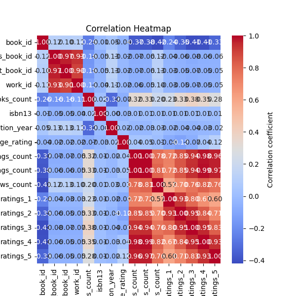

### Comprehensive Analysis of the Book Dataset

The analysis of the dataset encompassing 10,000 book records provides rich insights into various attributes related to the books, their identifiers, ratings, and publication years. Below are the key findings divided into summary statistics, missing values, correlation insights, and actionable recommendations for stakeholders involved in book publishing and marketing.

#### Summary Statistics

1. **Identifiers and Books Count:**
   - The `book_id` ranges from 1 to 10,000 with a mean of 5000.5, indicating uniform distribution.
   - The `goodreads_book_id`, `best_book_id`, and `work_id` show a wide range and high standard deviations, indicating variations in book popularity and an extensive catalog of works.

2. **Publication Year:**
   - The mean original publication year is around 1982, with the earliest records dating back to 1750, possibly indicating historical texts.
   - The spread in the `original_publication_year` suggests the dataset includes both contemporary and classical works, offering diverse content for readers.

3. **Ratings and Reviews:**
   - The `average_rating` across books is around 4.00 on a five-point scale, suggesting a favorable reception.
   - `ratings_count` has a mean of approximately 54,000, highlighting an engaged reader base. However, the presence of books with very few ratings (minimum 2,716) suggests there are less popular or newly added books.

4. **Authors and Languages:**
   - There are 4,664 unique authors, indicating diverse writing styles and subjects.
   - The most common language is English, but there's an opportunity for expansion into non-English markets given the presence of 25 unique language codes.

5. **Visual Representation:**
   - Initial visualizations, including distributions for IDs and a correlation heatmap are valuable for quickly grasping the dataset's key features.

#### Missing Values

The dataset shows several columns with missing values:
- ISBNs (`isbn` and `isbn13`) have significant missing rates, affecting 7% and 5.85% of records, respectively. This can hinder proper tracking and sales management.
- The `original_publication_year`, `original_title`, and `language_code` also show missing entries. These may reflect incomplete data collection processes.

#### Correlation Insights

1. **Negative Correlations with Ratings:**
   - There are notable negative correlations between `books_count` and various ratings metrics (including `ratings_count`, `work_ratings_count`, etc.). This suggests that works with fewer books published generally accumulate higher ratings, perhaps due to a more focused audience or better quality control.
   - High correlations between the star ratings indicate consistency in users' ratings across different categories, which may reflect a standardized rating scale among reviewers.

2. **Positive Correlation in Ratings:**
   - The ratings across levels (1 through 5) show a strong correlation with one another, indicating that a higher score in one category likely corresponds with higher scores in others.

#### Actionable Insights

1. **Improve Data Completeness:**
   - Prioritize obtaining ISBNs for books lacking them, as having complete ISBN data aids in sales tracking and inventory management.
   - Address the missing values in `original_publication_year` and `language_code`, as these factors can impact cataloging and audience targeting.

2. **Targeted Marketing Strategies:**
   - Leverage the insights from the correlation matrix to design marketing campaigns that highlight books with fewer total titles but higher ratings. These books could be promoted as "hidden gems" to potential readers.
   - Given the high engagement and positive average ratings, consider boosting promotional efforts for the most popular authors and categories, perhaps through social media campaigns or special offers.

3. **Diversification of Content:**
   - With a solid base in English, explore publishing or promoting translations of popular books into other languages, especially those with notable high ratings but limited availability.
   - Assess the potential to expand the catalog with niche genres or less represented authors, based on the diversity highlighted in unique authors.

4. **Continuous Monitoring and Updates:**
   - Regularly analyze emerging trends in book ratings and publication years to dynamically adjust marketing strategies and inventory management efforts.
   - Consider implementing a system for continuous feedback and data update to reduce missing values over time, ensuring the dataset remains relevant and comprehensive.

### Conclusion

This comprehensive analysis reveals a wealth of information that can guide strategic decisions in publishing, marketing, and audience engagement for the book ecosystem. By focusing on data completeness, targeted marketing, content diversification, and ongoing evaluation, stakeholders can enhance their offerings and better meet reader preferences.

