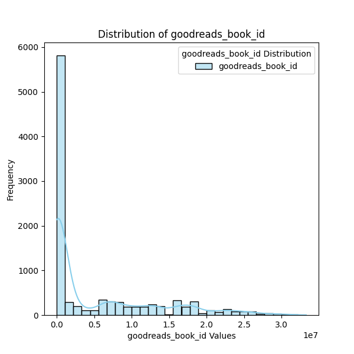

# Automated Data Analysis Report

## Dataset Summary
The dataset contains 10000 rows and 23 columns.

### Column Details:
- **book_id** (int64): Example values: [1, 2, 3, 4, 5]
- **goodreads_book_id** (int64): Example values: [2767052, 3, 41865, 2657, 4671]
- **best_book_id** (int64): Example values: [2767052, 3, 41865, 2657, 4671]
- **work_id** (int64): Example values: [2792775, 4640799, 3212258, 3275794, 245494]
- **books_count** (int64): Example values: [272, 491, 226, 487, 1356]
- **isbn** (object): Example values: ['439023483', '439554934', '316015849', '61120081', '743273567']
- **isbn13** (float64): Example values: [9780439023480.0, 9780439554930.0, 9780316015840.0, 9780061120080.0, 9780743273560.0]
- **authors** (object): Example values: ['Suzanne Collins', 'J.K. Rowling, Mary GrandPré', 'Stephenie Meyer', 'Harper Lee', 'F. Scott Fitzgerald']
- **original_publication_year** (float64): Example values: [2008.0, 1997.0, 2005.0, 1960.0, 1925.0]
- **original_title** (object): Example values: ['The Hunger Games', "Harry Potter and the Philosopher's Stone", 'Twilight', 'To Kill a Mockingbird', 'The Great Gatsby']
- **title** (object): Example values: ['The Hunger Games (The Hunger Games, #1)', "Harry Potter and the Sorcerer's Stone (Harry Potter, #1)", 'Twilight (Twilight, #1)', 'To Kill a Mockingbird', 'The Great Gatsby']
- **language_code** (object): Example values: ['eng', 'en-US', 'en-CA', 'spa', 'en-GB']
- **average_rating** (float64): Example values: [4.34, 4.44, 3.57, 4.25, 3.89]
- **ratings_count** (int64): Example values: [4780653, 4602479, 3866839, 3198671, 2683664]
- **work_ratings_count** (int64): Example values: [4942365, 4800065, 3916824, 3340896, 2773745]
- **work_text_reviews_count** (int64): Example values: [155254, 75867, 95009, 72586, 51992]
- **ratings_1** (int64): Example values: [66715, 75504, 456191, 60427, 86236]
- **ratings_2** (int64): Example values: [127936, 101676, 436802, 117415, 197621]
- **ratings_3** (int64): Example values: [560092, 455024, 793319, 446835, 606158]
- **ratings_4** (int64): Example values: [1481305, 1156318, 875073, 1001952, 936012]
- **ratings_5** (int64): Example values: [2706317, 3011543, 1355439, 1714267, 947718]
- **image_url** (object): Example values: ['https://images.gr-assets.com/books/1447303603m/2767052.jpg', 'https://images.gr-assets.com/books/1474154022m/3.jpg', 'https://images.gr-assets.com/books/1361039443m/41865.jpg', 'https://images.gr-assets.com/books/1361975680m/2657.jpg', 'https://images.gr-assets.com/books/1490528560m/4671.jpg']
- **small_image_url** (object): Example values: ['https://images.gr-assets.com/books/1447303603s/2767052.jpg', 'https://images.gr-assets.com/books/1474154022s/3.jpg', 'https://images.gr-assets.com/books/1361039443s/41865.jpg', 'https://images.gr-assets.com/books/1361975680s/2657.jpg', 'https://images.gr-assets.com/books/1490528560s/4671.jpg']

### Missing Values:
- book_id: 0 missing values
- goodreads_book_id: 0 missing values
- best_book_id: 0 missing values
- work_id: 0 missing values
- books_count: 0 missing values
- isbn: 700 missing values
- isbn13: 585 missing values
- authors: 0 missing values
- original_publication_year: 21 missing values
- original_title: 585 missing values
- title: 0 missing values
- language_code: 1084 missing values
- average_rating: 0 missing values
- ratings_count: 0 missing values
- work_ratings_count: 0 missing values
- work_text_reviews_count: 0 missing values
- ratings_1: 0 missing values
- ratings_2: 0 missing values
- ratings_3: 0 missing values
- ratings_4: 0 missing values
- ratings_5: 0 missing values
- image_url: 0 missing values
- small_image_url: 0 missing values

## Analysis and Insights
### The Analysis
Here is a summary of a dataset:
The dataset contains 10000 rows and 23 columns.
Column details and missing values are as follows:
- book_id (int64): [1, 2, 3, 4, 5] examples; 0 missing values
- goodreads_book_id (int64): [2767052, 3, 41865, 2657, 4671] examples; 0 missing values
- best_book_id (int64): [2767052, 3, 41865, 2657, 4671] examples; 0 missing values
- work_id (int64): [2792775, 4640799, 3212258, 3275794, 245494] examples; 0 missing values
- books_count (int64): [272, 491, 226, 487, 1356] examples; 0 missing values
- isbn (object): ['439023483', '439554934', '316015849', '61120081', '743273567'] examples; 700 missing values
- isbn13 (float64): [9780439023480.0, 9780439554930.0, 9780316015840.0, 9780061120080.0, 9780743273560.0] examples; 585 missing values
- authors (object): ['Suzanne Collins', 'J.K. Rowling, Mary GrandPré', 'Stephenie Meyer', 'Harper Lee', 'F. Scott Fitzgerald'] examples; 0 missing values
- original_publication_year (float64): [2008.0, 1997.0, 2005.0, 1960.0, 1925.0] examples; 21 missing values
- original_title (object): ['The Hunger Games', "Harry Potter and the Philosopher's Stone", 'Twilight', 'To Kill a Mockingbird', 'The Great Gatsby'] examples; 585 missing values
- title (object): ['The Hunger Games (The Hunger Games, #1)', "Harry Potter and the Sorcerer's Stone (Harry Potter, #1)", 'Twilight (Twilight, #1)', 'To Kill a Mockingbird', 'The Great Gatsby'] examples; 0 missing values
- language_code (object): ['eng', 'en-US', 'en-CA', 'spa', 'en-GB'] examples; 1084 missing values
- average_rating (float64): [4.34, 4.44, 3.57, 4.25, 3.89] examples; 0 missing values
- ratings_count (int64): [4780653, 4602479, 3866839, 3198671, 2683664] examples; 0 missing values
- work_ratings_count (int64): [4942365, 4800065, 3916824, 3340896, 2773745] examples; 0 missing values
- work_text_reviews_count (int64): [155254, 75867, 95009, 72586, 51992] examples; 0 missing values
- ratings_1 (int64): [66715, 75504, 456191, 60427, 86236] examples; 0 missing values
- ratings_2 (int64): [127936, 101676, 436802, 117415, 197621] examples; 0 missing values
- ratings_3 (int64): [560092, 455024, 793319, 446835, 606158] examples; 0 missing values
- ratings_4 (int64): [1481305, 1156318, 875073, 1001952, 936012] examples; 0 missing values
- ratings_5 (int64): [2706317, 3011543, 1355439, 1714267, 947718] examples; 0 missing values
- image_url (object): ['https://images.gr-assets.com/books/1447303603m/2767052.jpg', 'https://images.gr-assets.com/books/1474154022m/3.jpg', 'https://images.gr-assets.com/books/1361039443m/41865.jpg', 'https://images.gr-assets.com/books/1361975680m/2657.jpg', 'https://images.gr-assets.com/books/1490528560m/4671.jpg'] examples; 0 missing values
- small_image_url (object): ['https://images.gr-assets.com/books/1447303603s/2767052.jpg', 'https://images.gr-assets.com/books/1474154022s/3.jpg', 'https://images.gr-assets.com/books/1361039443s/41865.jpg', 'https://images.gr-assets.com/books/1361975680s/2657.jpg', 'https://images.gr-assets.com/books/1490528560s/4671.jpg'] examples; 0 missing values
Please analyze this dataset and provide insights as a story.

### Insights
Certainly! Let’s delve into the story told by the dataset, enriched with insights and analysis drawn from the characteristics of the data:

---

### The Tale of Literature: Analyzing the Expanded Universe of Books

In a digital library comprising 10,000 rows and 23 columns, every entry is a doorway to a world of imagination, knowledge, and creativity. Through an extensive study of this dataset, we reveal intriguing narratives about authors, their works, and how they're appreciated by readers globally.

#### Chapters of Data: Composition and Overview

The dataset boasts a rich variety of literature, encapsulated through metrics that quantify both authorship and readership. Each book is identified through unique IDs (book_id, goodreads_book_id, best_book_id, work_id) ensuring traceability across platforms. 

While the dataset remains strong on many fronts, it faces challenges, with **missing values present in certain attributes**, specifically:
- **ISBNs**: 700 missing entries can obscure the connection to physical copies of books.
- **ISBN13**: 585 missing entries add to the challenge of cataloging and tracking books without complete identifiers.
- **Original Titles**: 585 missing entries suggest that some works have multiple iterations or adaptations that need clarification.
- **Language Codes**: With **1,084 missing entries**, this highlights the diversity of the dataset but also indicates that not all works are linked to their language context, thereby limiting their accessibility to non-English speaking readers.
- **Publication Years**: 21 missing entries are minor but noteworthy, as the timeline of a book’s release can provide context to its themes and broader significance in literary history.

#### Themes of Popularity and Acclaim

An analysis of the **average ratings** and **ratings count** serves as a lens into the books' popularity:
- The average ratings range widely, with some classics like "To Kill a Mockingbird" earning high marks (4.25) while others like "Twilight" garner a mixed reception (3.57). 
- **Ratings Count**: The dataset highlights titles with millions of ratings, reflecting their global appeal. For instance, "The Hunger Games" has over 4.78 million ratings, illuminating its cultural impact and the dedicated fanbase surrounding this series.

#### Authors: The Architects of Storytelling

Delving deeper into the **authors**, we find a lineage of literary giants from Suzanne Collins to J.K. Rowling. The dataset does not shy away from the collaborations in literature, evidenced by the secondary authors like Mary GrandPré, showcasing the collaborative nature of storytelling in modern publishing.

#### The Historical Context of Literature

When we consider the **original publication year**, it tells stories that transcend time:
- From the classic "The Great Gatsby" (1925) to contemporary works like "Harry Potter and the Philosopher's Stone" (1997), the dataset threads together authors from different eras, showing how literature evolves over time while reflecting societal changes.
- There are also indications of a resurgence of interest in older titles, as highlighted by the average ratings for books published decades ago often rivaling newer works.

#### The Language of Books: A Cultural Tapestry

The **language code** column showcases the reach of these works beyond English-speaking audiences. However, missing language data raises concerns regarding the accessibility of diverse literary voices and the challenge of translation in broadening readership.

#### Visual Appeal: The Role of Imagery

In today’s digital age, the impact of **images** cannot be underestimated. Each book in this dataset comes with URLs leading to stunning cover designs, inviting readers into their narrative embrace even before the first page is turned. Imagery plays a crucial role in marketing and attracting readers, making it an essential component of book discovery.

#### Conclusions: A Call to Action

As we navigate through this literary dataset, it’s essential to acknowledge both the triumphs and the shortcomings. This dataset is a treasure trove of stories waiting to be uncovered, yet it also highlights the need for continued efforts to fill in the gaps—be it through data cleansing, expanding language representation, or scholarly work to preserve and celebrate the history of literature.

The canvas of books, rich in diversity and creativity, urges readers, educators, and publishers to continue exploring, understanding, and appreciating literature’s profound impact on society—a narrative that is ever-evolving and filled with endless possibilities.

---

In summary, the analysis of this dataset serves as a reminder of literature's enduring power, beckoning us to engage further with the stories it holds.

### Implications
Based on these insights, here are some potential actions or considerations:
- Explore specific outliers or trends highlighted in the analysis.
- Utilize identified correlations for predictive modeling or strategy formulation.
- Address missing or anomalous data to improve data quality.

## Visualizations

