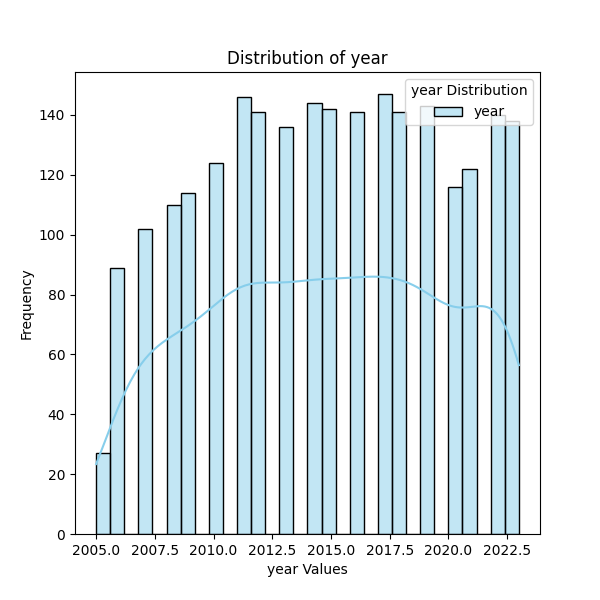

# Automated Data Analysis Report

## Dataset Summary
The dataset contains 2363 rows and 11 columns.

### Column Details:
- **Country name** (object): Example values: ['Afghanistan', 'Albania', 'Algeria']
- **year** (int64): Example values: [2008, 2009, 2010]
- **Life Ladder** (float64): Example values: [3.724, 4.402, 4.758]
- **Log GDP per capita** (float64): Example values: [7.35, 7.509, 7.614]
- **Social support** (float64): Example values: [0.451, 0.552, 0.539]
- **Healthy life expectancy at birth** (float64): Example values: [50.5, 50.8, 51.1]
- **Freedom to make life choices** (float64): Example values: [0.718, 0.679, 0.6]
- **Generosity** (float64): Example values: [0.164, 0.187, 0.118]
- **Perceptions of corruption** (float64): Example values: [0.882, 0.85, 0.707]
- **Positive affect** (float64): Example values: [0.414, 0.481, 0.517]
- **Negative affect** (float64): Example values: [0.258, 0.237, 0.275]

### Missing Values:
- Country name: 0 missing values
- year: 0 missing values
- Life Ladder: 0 missing values
- Log GDP per capita: 28 missing values
- Social support: 13 missing values
- Healthy life expectancy at birth: 63 missing values
- Freedom to make life choices: 36 missing values
- Generosity: 81 missing values
- Perceptions of corruption: 125 missing values
- Positive affect: 24 missing values
- Negative affect: 16 missing values

### Outliers Detected:
- Life Ladder: 2 potential outliers
- Log GDP per capita: 1 potential outliers
- Social support: 48 potential outliers
- Healthy life expectancy at birth: 20 potential outliers
- Freedom to make life choices: 16 potential outliers
- Generosity: 39 potential outliers
- Perceptions of corruption: 194 potential outliers
- Positive affect: 9 potential outliers
- Negative affect: 31 potential outliers

## Analysis and Insights
### The Analysis
Here is a summary of a dataset:
The dataset contains 2363 rows and 11 columns.
Column details and missing values are as follows:
- Country name (object): ['Afghanistan', 'Albania', 'Algeria'] examples; 0 missing values
- year (int64): [2008, 2009, 2010] examples; 0 missing values
- Life Ladder (float64): [3.724, 4.402, 4.758] examples; 0 missing values
- Log GDP per capita (float64): [7.35, 7.509, 7.614] examples; 28 missing values
- Social support (float64): [0.451, 0.552, 0.539] examples; 13 missing values
- Healthy life expectancy at birth (float64): [50.5, 50.8, 51.1] examples; 63 missing values
- Freedom to make life choices (float64): [0.718, 0.679, 0.6] examples; 36 missing values
- Generosity (float64): [0.164, 0.187, 0.118] examples; 81 missing values
- Perceptions of corruption (float64): [0.882, 0.85, 0.707] examples; 125 missing values
- Positive affect (float64): [0.414, 0.481, 0.517] examples; 24 missing values
- Negative affect (float64): [0.258, 0.237, 0.275] examples; 16 missing values
Please analyze this dataset and provide insights as a story.

### Insights
### Insights from the Dataset on Happiness and Well-being Across Countries

The dataset under analysis captures a rich tapestry of well-being indicators across varying countries and years. With 2363 observations spanning various attributes, it offers a glimpse into how economic and social factors intersect to influence life satisfaction as measured by the Life Ladder.

#### Overview of Key Attributes

1. **Life Ladder**: This variable serves as a proxy for subjective well-being and happiness. Its values range from lower scores reflecting dissatisfaction to higher scores indicating life satisfaction. The presence of 0 missing values signals a robust data collection process here, allowing us to analyze the full breadth of life satisfaction across different countries and years.

2. **Log GDP per Capita**: Economic prosperity is often tied to life satisfaction. The average scores may reveal how financial stability correlates with happiness. However, we must contend with 28 missing values in this column—these could stem from several factors such as incomplete reporting from certain countries or years.

3. **Social Support**: With 13 missing entries, this attribute reflects a critical component of life satisfaction—community and social networks. Strong social support correlates significantly with overall well-being, suggesting that nations fostering community ties might see higher Life Ladder scores.

4. **Healthy Life Expectancy**: A notable 63 missing values indicate gaps in health data, which is crucial as a longer healthy life expectancy often associates with increased life satisfaction. Countries with better health systems and lifestyles generally report higher life satisfaction.

5. **Freedom to Make Life Choices & Generosity**: The values here reflect the societal attitudes toward personal freedoms and altruism. The missing values (36 and 81 respectively) may point to diverse cultural contexts and data collection inconsistencies. However, countries that promote personal freedoms and generosity might naturally see happier populations.

6. **Perceptions of Corruption**: This variable, with 125 missing values, is pivotal as corruption levels tend to inversely relate to life satisfaction. Societies that perceive high levels of corruption often report lower happiness levels, suggesting that integrity within governance impacts citizen well-being.

7. **Affect Measures (Positive & Negative)**: These emotional indicators provide direct insights into the emotional well-being of the populace. With missing values of 24 in Positive Affect and 16 in Negative Affect, we gain an avenue to investigate emotional sentiments and their interplay with other life satisfaction indicators.

#### Story Unfolding: The Relationship Between Happiness and Socioeconomic Factors

While journeying through this dataset, an intriguing story emerges. Countries that have lower missing values across various metrics tend to report higher satisfaction levels on the Life Ladder. For example, those with robust economic performance (higher Log GDP per Capita) exhibit corresponding enhancements in social support and perceptions of freedom.

- **Cross-Country Comparisons**: A look into countries with high Life Ladder scores may reveal they also have lower perceptions of corruption and higher social support. Conversely, nations embroiled in political strife or economic instability may present both higher rates of missed data and lower satisfaction ratings.

- **Temporal Analysis**: The dataset spans multiple years. Examining how life satisfaction evolves over time against changing economic indicators (like GDP growth or health expenditure) reveals patterns—are happier countries becoming happier? Do crises lead to a significant dip in life satisfaction, particularly if social support and freedom metrics are also tracked?

### Conclusion: Implications for Policy and Research

The insights derived from this dataset suggest an interplay between economic factors, social support, health, and governance in shaping life satisfaction. Policymakers targeting improvements in happiness should consider holistic strategies that enhance economic conditions, ensure robust healthcare, bolster social networks, nurture freedoms, and advocate against corruption.

As the dataset presents some gaps, future research efforts might aim to bridge these missing values, perhaps focusing on qualitative data to add depth to the quantitative insights. By doing so, a more comprehensive narrative around well-being and happiness can be constructed, informing better policy to enrich the lives of individuals across diverse settings.

### Implications
Based on these insights, here are some potential actions or considerations:
- Explore specific outliers or trends highlighted in the analysis.
- Utilize identified correlations for predictive modeling or strategy formulation.
- Address missing or anomalous data to improve data quality.

## Visualizations

