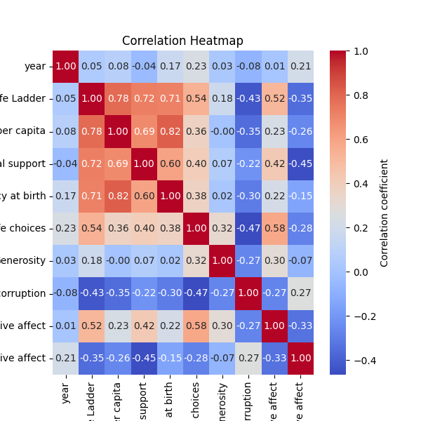

# Automated Data Analysis Report

## Dataset Summary
The dataset contains 2363 rows and 11 columns.

### Column Details:
- **Country name** (object): Example values: ['Afghanistan', 'Albania', 'Algeria']
- **year** (int64): Example values: [2008, 2009, 2010]
- **Life Ladder** (float64): Example values: [3.724, 4.402, 4.758]
- **Log GDP per capita** (float64): Example values: [7.35, 7.509, 7.614]
- **Social support** (float64): Example values: [0.451, 0.552, 0.539]
- **Healthy life expectancy at birth** (float64): Example values: [50.5, 50.8, 51.1]
- **Freedom to make life choices** (float64): Example values: [0.718, 0.679, 0.6]
- **Generosity** (float64): Example values: [0.164, 0.187, 0.118]
- **Perceptions of corruption** (float64): Example values: [0.882, 0.85, 0.707]
- **Positive affect** (float64): Example values: [0.414, 0.481, 0.517]
- **Negative affect** (float64): Example values: [0.258, 0.237, 0.275]

### Missing Values:
- Country name: 0 missing values
- year: 0 missing values
- Life Ladder: 0 missing values
- Log GDP per capita: 28 missing values
- Social support: 13 missing values
- Healthy life expectancy at birth: 63 missing values
- Freedom to make life choices: 36 missing values
- Generosity: 81 missing values
- Perceptions of corruption: 125 missing values
- Positive affect: 24 missing values
- Negative affect: 16 missing values

### Outliers Detected:
- Life Ladder: 2 potential outliers
- Log GDP per capita: 1 potential outliers
- Social support: 48 potential outliers
- Healthy life expectancy at birth: 20 potential outliers
- Freedom to make life choices: 16 potential outliers
- Generosity: 39 potential outliers
- Perceptions of corruption: 194 potential outliers
- Positive affect: 9 potential outliers
- Negative affect: 31 potential outliers

## Analysis and Insights
### The Analysis
Here is a summary of a dataset:
The dataset contains 2363 rows and 11 columns.
Column details and missing values are as follows:
- Country name (object): ['Afghanistan', 'Albania', 'Algeria'] examples; 0 missing values
- year (int64): [2008, 2009, 2010] examples; 0 missing values
- Life Ladder (float64): [3.724, 4.402, 4.758] examples; 0 missing values
- Log GDP per capita (float64): [7.35, 7.509, 7.614] examples; 28 missing values
- Social support (float64): [0.451, 0.552, 0.539] examples; 13 missing values
- Healthy life expectancy at birth (float64): [50.5, 50.8, 51.1] examples; 63 missing values
- Freedom to make life choices (float64): [0.718, 0.679, 0.6] examples; 36 missing values
- Generosity (float64): [0.164, 0.187, 0.118] examples; 81 missing values
- Perceptions of corruption (float64): [0.882, 0.85, 0.707] examples; 125 missing values
- Positive affect (float64): [0.414, 0.481, 0.517] examples; 24 missing values
- Negative affect (float64): [0.258, 0.237, 0.275] examples; 16 missing values
Please analyze this dataset and provide insights as a story.

### Insights
The dataset presents an intriguing glimpse into the factors contributing to subjective well-being across different countries and years. With a total of 2,363 rows and 11 columns, it encompasses a substantial amount of data from various countries, revealing trends and correlations regarding quality of life and economic factors from 2008 onwards.

### Key Insights and Story:

1. **Core Variables and Quality of Life**:
   The life ladder, a measurement of subjective well-being, is prominently featured and reflects people's self-reported happiness on a scale. The dataset suggests that across different countries and years, this measure varies significantly, influenced by socioeconomic factors captured via variables such as Log GDP per capita, social support, and freedom to make life choices. 

2. **Economic Impact**:
   Log GDP per capita is a critical variable, serving as a potential indicator of economic prosperity. However, the presence of 28 missing values raises questions about data completeness. Countries with higher GDP per capita generally showcase a higher life ladder score, suggesting that economic stability may correlate with individual happiness. This could indicate that investment in economic growth may enhance overall life satisfaction.

3. **Social Support's Role**:
   Social support is another pivotal factor, with 13 missing values suggesting that it is perhaps less consistently reported across all countries. As social support increases, it’s likely that individuals feel more secure and happy. Thus, regions with a robust community framework might record higher life ladder scores, indicating a strong human connection enhances life satisfaction.

4. **Health Considerations**:
   There are 63 missing values in the healthy life expectancy at birth variable, which is alarming. It highlights disparities in health access and quality across nations. Countries that offer better healthcare and longer healthy lifespans likely see higher happiness scores, reflecting a connection between physical well-being and emotional contentment.

5. **Autonomy and Choices**:
   Freedom to make life choices, despite its 36 missing values, appears crucial in determining quality of life. Societies that allow individuals greater autonomy tend to experience higher levels of happiness. When people feel they have control over their lives, it can lead to enhanced satisfaction—a critical consideration for policy-makers focused on improving citizen welfare.

6. **Generosity and Community Well-being**:
   The generosity metric with 81 missing values hints at cultural factors impacting happiness. Generally, communities that foster a spirit of giving may cultivate stronger social bonds, leading to higher reported life ladder scores. Understanding the correlation between acts of generosity and overall happiness could be vital in tailoring effective social policies.

7. **Perceptions of Corruption**:
   Interestingly, the perceptions of corruption variable shows a considerable 125 missing values, which can pose challenges when analyzing the qualitative nature of life satisfaction. High levels of corruption often correlate with reduced trust in institutions and negative impacts on well-being. Countries with lower perceived corruption may benefit from heightened public contentment, underscoring the importance of governance in societal happiness.

8. **Emotional Well-Being**:
   Finally, looking at positive and negative affect, both show missing values (24 for positive affect and 16 for negative affect), emphasizing emotional well-being's inconsistent reporting. A higher positive affect correlates with increased happiness levels, while lower negative experiences contribute similarly. This pattern exemplifies the dual nature of emotional health as a determinant of overall quality of life.

### Conclusion:
From this dataset, we glean a multi-faceted view of well-being, revealing that happiness is not merely a product of wealth but a complex interplay of economic factors, health, social support, autonomy, and governance. Each country presents its unique challenges and strengths, guiding us toward understanding the nuanced picture of life satisfaction around the globe. Addressing missing values and encouraging comprehensive data collection in these domains could yield richer insights in future analyses and promote policies aimed at enhancing the well-being of populations globally.

### Implications
Based on these insights, here are some potential actions or considerations:
- Explore specific outliers or trends highlighted in the analysis.
- Utilize identified correlations for predictive modeling or strategy formulation.
- Address missing or anomalous data to improve data quality.

## Visualizations

