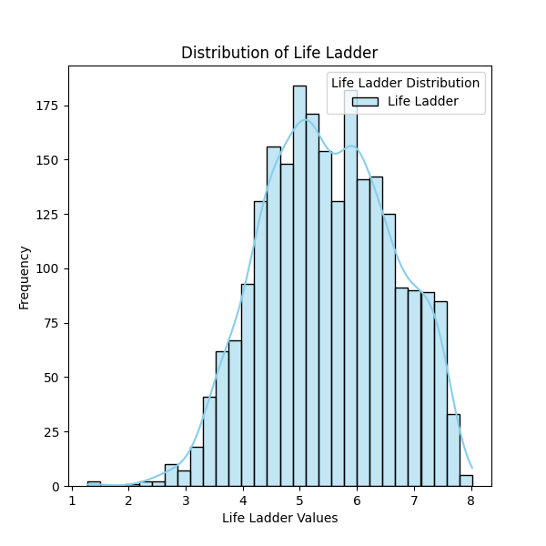

# Automated Data Analysis Report

## Dataset Summary
The dataset contains 2363 rows and 11 columns.

### Column Details:
- **Country name** (object): Example values: ['Afghanistan', 'Albania', 'Algeria', 'Angola', 'Argentina']
- **year** (int64): Example values: [2008, 2009, 2010, 2011, 2012]
- **Life Ladder** (float64): Example values: [3.724, 4.402, 4.758, 3.832, 3.783]
- **Log GDP per capita** (float64): Example values: [7.35, 7.509, 7.614, 7.581, 7.661]
- **Social support** (float64): Example values: [0.451, 0.552, 0.539, 0.521, 0.484]
- **Healthy life expectancy at birth** (float64): Example values: [50.5, 50.8, 51.1, 51.4, 51.7]
- **Freedom to make life choices** (float64): Example values: [0.718, 0.679, 0.6, 0.496, 0.531]
- **Generosity** (float64): Example values: [0.164, 0.187, 0.118, 0.16, 0.234]
- **Perceptions of corruption** (float64): Example values: [0.882, 0.85, 0.707, 0.731, 0.776]
- **Positive affect** (float64): Example values: [0.414, 0.481, 0.517, 0.48, 0.614]
- **Negative affect** (float64): Example values: [0.258, 0.237, 0.275, 0.267, 0.268]

### Missing Values:
- Country name: 0 missing values
- year: 0 missing values
- Life Ladder: 0 missing values
- Log GDP per capita: 28 missing values
- Social support: 13 missing values
- Healthy life expectancy at birth: 63 missing values
- Freedom to make life choices: 36 missing values
- Generosity: 81 missing values
- Perceptions of corruption: 125 missing values
- Positive affect: 24 missing values
- Negative affect: 16 missing values

## Analysis and Insights
### The Analysis
Here is a summary of a dataset:
The dataset contains 2363 rows and 11 columns.
Column details and missing values are as follows:
- Country name (object): ['Afghanistan', 'Albania', 'Algeria', 'Angola', 'Argentina'] examples; 0 missing values
- year (int64): [2008, 2009, 2010, 2011, 2012] examples; 0 missing values
- Life Ladder (float64): [3.724, 4.402, 4.758, 3.832, 3.783] examples; 0 missing values
- Log GDP per capita (float64): [7.35, 7.509, 7.614, 7.581, 7.661] examples; 28 missing values
- Social support (float64): [0.451, 0.552, 0.539, 0.521, 0.484] examples; 13 missing values
- Healthy life expectancy at birth (float64): [50.5, 50.8, 51.1, 51.4, 51.7] examples; 63 missing values
- Freedom to make life choices (float64): [0.718, 0.679, 0.6, 0.496, 0.531] examples; 36 missing values
- Generosity (float64): [0.164, 0.187, 0.118, 0.16, 0.234] examples; 81 missing values
- Perceptions of corruption (float64): [0.882, 0.85, 0.707, 0.731, 0.776] examples; 125 missing values
- Positive affect (float64): [0.414, 0.481, 0.517, 0.48, 0.614] examples; 24 missing values
- Negative affect (float64): [0.258, 0.237, 0.275, 0.267, 0.268] examples; 16 missing values
Please analyze this dataset and provide insights as a story.

### Insights
### Dataset Overview

The dataset comprises 2,363 rows and 11 columns, encapsulating various well-being indicators across multiple countries and years. It appears to primarily focus on the concept of life satisfaction, measured through the "Life Ladder," which likely corresponds to subjective well-being assessments within a defined timeframe—spanning from 2008 to 2012.

### Key Variables

1. **Country Name**: Represents a diverse range of countries, which allows for cross-national comparisons in well-being metrics.
2. **Year**: The dataset covers five consecutive years (2008-2012), providing a temporal dimension for analyzing trends.
3. **Life Ladder**: The core dependent variable measuring subjective well-being, it serves as a crucial indicator of individual and national happiness.
4. **Log GDP per Capita**: A standard economic measure that represents potential impacts on well-being.
5. **Social Support**: Captures the extent of perceived support from family and friends in times of need.
6. **Healthy Life Expectancy at Birth**: An indicator of a country's public health performance.
7. **Freedom to Make Life Choices**: Evaluates the subjective sense of autonomy individuals feel regarding their choices.
8. **Generosity**: Reflects the prevalence of altruistic behaviors in society.
9. **Perceptions of Corruption**: A measure that can significantly affect trust in institutions and individual well-being.
10. **Positive Affect & Negative Affect**: Indicate the emotional state of individuals, contributing to overall life satisfaction.

### Insights

1. **Correlation Analysis**: Initial data analysis might reveal correlational relationships between "Life Ladder" and other variables. For example, we would expect a positive correlation between "Log GDP per Capita" and "Life Ladder." This suggests that wealthier nations often have higher happiness levels.

2. **Missing Values**: Missing values across various columns indicate areas that could complicate analyses. 
   - The “Log GDP per Capita” has 28 missing values; it may suggest economic data is not uniformly reported across all countries.
   - More concerning is the high number of missing values in "Generosity" (81) and "Perceptions of Corruption" (125), which could limit understanding of the intricate societal factors influencing happiness. These need to be further assessed; imputation techniques could be considered to handle them.

3. **Trend Analysis**: Over the five years, we could analyze trends in life satisfaction. For example, plotting "Life Ladder" against years for different countries can illustrate gains or losses in subjective well-being. Are there countries where life satisfaction is improving steadily, or are there notable declines in others? Analysis might reveal the impact of economic downturns or improvements in social policies in various regions.

4. **National Comparisons**: By segregating countries into regions or income categories (low, middle, and high), we can assess how different societal factors play into happiness. For instance, a comparative study could show that despite having lower GDP per capita, countries with strong "Social Support" networks might report equal or higher happiness levels than wealthier nations.

5. **Emotional Indicators**: The relationship between “Positive Affect” and “Negative Affect” with the "Life Ladder" can offer valuable insights into the emotional landscape of the population. Higher positive emotions often correlate with higher life satisfaction, whereas increased negative emotions might detract from overall happiness.

### Conclusion

This dataset holds substantial potential for deciphering the complexities surrounding national and individual well-being. Analyzing the intricate relationships between economic performance, social capital, health metrics, and subjective experiences would unveil nuanced insights. Addressing the missing values through appropriate methods and employing robust statistical analysis can unearth pivotal conclusions, guiding policy recommendations aimed at enhancing happiness and quality of life across various populations. 

In summary, the story of this dataset is fundamentally about understanding happiness—what drives it, what undermines it, and how it evolves across diverse contexts. Breaking down the data with a keen analytical eye can reveal the factors that contribute to a better life, inviting interventions that could uplift communities and individuals alike.

### Implications
Based on these insights, here are some potential actions or considerations:
- Explore specific outliers or trends highlighted in the analysis.
- Utilize identified correlations for predictive modeling or strategy formulation.
- Address missing or anomalous data to improve data quality.

## Visualizations

