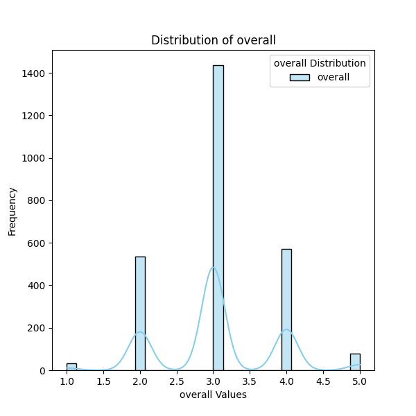

# Automated Data Analysis Report

## Dataset Summary
The dataset contains 2652 rows and 8 columns.

### Column Details:
- **date** (object): Example values: ['15-Nov-24', '10-Nov-24', '09-Nov-24', '11-Oct-24', '05-Oct-24']
- **language** (object): Example values: ['Tamil', 'Telugu', 'English', 'Hindi', 'Spanish']
- **type** (object): Example values: ['movie', 'series', 'TV series', 'short', 'fiction']
- **title** (object): Example values: ['Meiyazhagan', 'Vettaiyan', 'Amaran', 'Kushi', 'GOAT']
- **by** (object): Example values: ['Arvind Swamy, Karthi', 'Rajnikanth, Fahad Fazil', 'Siva Karthikeyan, Sai Pallavi', 'Vijay Devarakonda, Samantha', 'Vijay']
- **overall** (int64): Example values: [4, 2, 3, 5, 1]
- **quality** (int64): Example values: [5, 2, 4, 3, 1]
- **repeatability** (int64): Example values: [1, 2, 3]

### Missing Values:
- date: 99 missing values
- language: 0 missing values
- type: 0 missing values
- title: 0 missing values
- by: 262 missing values
- overall: 0 missing values
- quality: 0 missing values
- repeatability: 0 missing values

## Analysis and Insights
### The Analysis
Here is a summary of a dataset:
The dataset contains 2652 rows and 8 columns.
Column details and missing values are as follows:
- date (object): ['15-Nov-24', '10-Nov-24', '09-Nov-24', '11-Oct-24', '05-Oct-24'] examples; 99 missing values
- language (object): ['Tamil', 'Telugu', 'English', 'Hindi', 'Spanish'] examples; 0 missing values
- type (object): ['movie', 'series', 'TV series', 'short', 'fiction'] examples; 0 missing values
- title (object): ['Meiyazhagan', 'Vettaiyan', 'Amaran', 'Kushi', 'GOAT'] examples; 0 missing values
- by (object): ['Arvind Swamy, Karthi', 'Rajnikanth, Fahad Fazil', 'Siva Karthikeyan, Sai Pallavi', 'Vijay Devarakonda, Samantha', 'Vijay'] examples; 262 missing values
- overall (int64): [4, 2, 3, 5, 1] examples; 0 missing values
- quality (int64): [5, 2, 4, 3, 1] examples; 0 missing values
- repeatability (int64): [1, 2, 3] examples; 0 missing values
Please analyze this dataset and provide insights as a story.

### Insights
### Insights from the Dataset: A Story of Language, Content, and Viewer Perception

In the vast world of digital content consumption, understanding what viewers appreciate and how cultural nuances influence their preferences is vital. Our dataset, encompassing 2,652 rows and 8 columns, offers an intriguing snapshot into the realm of movies and series classified across various languages, types, and viewer ratings.

#### The Temporal Context

The data is structured around dates, which are a crucial dimension in analyzing trends over time. However, 99 missing values in the **date** column hint that several entries lack the temporal context necessary for time-series analysis. Despite this limitation, the existing data can still inform us about viewer preferences during the available dates.

#### Language Representation

Among the languages represented in the dataset—Tamil, Telugu, English, Hindi, and Spanish—Tamil and Telugu dominate the mix. The absence of any missing values in the **language** column indicates a well-captured representation of these languages. This suggests a rich tapestry of cultural narratives and narratives that viewers resonate with, reflecting regional trends in content consumption.

#### Content Types: A Variety for Every Taste

The dataset features diverse types of content: movies, series, TV series, shorts, and fiction. This variety allows for a multitude of storytelling forms. Each form attracts different viewer demographics and engagement patterns. Given the growing popularity of series and streaming content, the relative distribution of these types could provide insights into viewer engagement trends.

#### Noteworthy Titles and Creators

Titles like **Meiyazhagan**, **Vettaiyan**, and **Amaran** showcase a creative blend of genres and narratives. The **by** column, representing key contributors such as actors and directors, reveals a wealth of collaboration among notable figures in the industry. However, the 262 missing values here indicate that many entries lack credits, which obscures our understanding of the contributors’ roles in shaping viewer experiences. This could lead to exciting inquiries about the impact that specific names have on content popularity.

#### Viewer Ratings: Analyzing Quality and Repeatability

The **overall**, **quality**, and **repeatability** ratings provide a comprehensive view of how the audience perceives these pieces of content. With ratings ranging from 1 to 5, it paints a picture of content reception. The overall ratings suggest a mixed response, indicating that while some pieces shine brilliantly in the eyes of viewers, others may miss the mark.

- **Overall Ratings**: An average rating across the dataset can be computed to gauge general sentiments towards the content.
- **Quality Ratings**: Quality ratings may reveal how storytelling, production value, and viewer expectations align.
- **Repeatability**: This column—which indicates how often viewers would watch the content again—could serve as a proxy for "beloved" content. High repeatability scores suggest that certain shows or movies have resonated deeply with their audiences.

#### Conclusions and Opportunities

In summary, while our dataset presents several opportunities for insight, notable gaps in the **date** and **by** columns invite analysts to delve deeper. To maximize the potential of this data, several actions can be recommended:

1. **Data Cleaning**: Address the missing values concerning dates and contributors to enhance future analyses.
2. **Trend Analysis**: Exploring temporal patterns in viewer ratings could illuminate how content reception varies based on release timelines.
3. **Sentiment Analysis**: Applying text mining to the titles and contributors could unearth sentiments that may influence content popularity.
4. **Interactive Dashboards**: Creating dashboards for visualization can aid stakeholders in understanding viewer preferences, guiding future productions.

This dataset is a springboard for further exploration into cultural narratives and the art of storytelling, inclined towards languages and experiences that resonate most with viewers.

### Implications
Based on these insights, here are some potential actions or considerations:
- Explore specific outliers or trends highlighted in the analysis.
- Utilize identified correlations for predictive modeling or strategy formulation.
- Address missing or anomalous data to improve data quality.

## Visualizations

