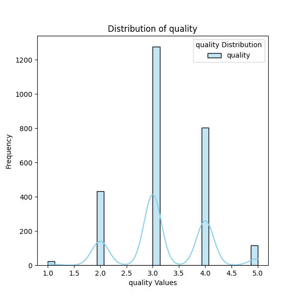

# Automated Data Analysis Report

## Dataset Summary
The dataset contains 2652 rows and 8 columns.

### Column Details:
- **date** (object): Example values: ['15-Nov-24', '10-Nov-24', '09-Nov-24', '11-Oct-24', '05-Oct-24']
- **language** (object): Example values: ['Tamil', 'Telugu', 'English', 'Hindi', 'Spanish']
- **type** (object): Example values: ['movie', 'series', 'TV series', 'short', 'fiction']
- **title** (object): Example values: ['Meiyazhagan', 'Vettaiyan', 'Amaran', 'Kushi', 'GOAT']
- **by** (object): Example values: ['Arvind Swamy, Karthi', 'Rajnikanth, Fahad Fazil', 'Siva Karthikeyan, Sai Pallavi', 'Vijay Devarakonda, Samantha', 'Vijay']
- **overall** (int64): Example values: [4, 2, 3, 5, 1]
- **quality** (int64): Example values: [5, 2, 4, 3, 1]
- **repeatability** (int64): Example values: [1, 2, 3]

### Missing Values:
- date: 99 missing values
- language: 0 missing values
- type: 0 missing values
- title: 0 missing values
- by: 262 missing values
- overall: 0 missing values
- quality: 0 missing values
- repeatability: 0 missing values

### Outliers Detected:

## Analysis and Insights
### The Analysis
Here is a summary of a dataset:
The dataset contains 2652 rows and 8 columns.
Column details and missing values are as follows:
- date (object): ['15-Nov-24', '10-Nov-24', '09-Nov-24', '11-Oct-24', '05-Oct-24'] examples; 99 missing values
- language (object): ['Tamil', 'Telugu', 'English', 'Hindi', 'Spanish'] examples; 0 missing values
- type (object): ['movie', 'series', 'TV series', 'short', 'fiction'] examples; 0 missing values
- title (object): ['Meiyazhagan', 'Vettaiyan', 'Amaran', 'Kushi', 'GOAT'] examples; 0 missing values
- by (object): ['Arvind Swamy, Karthi', 'Rajnikanth, Fahad Fazil', 'Siva Karthikeyan, Sai Pallavi', 'Vijay Devarakonda, Samantha', 'Vijay'] examples; 262 missing values
- overall (int64): [4, 2, 3, 5, 1] examples; 0 missing values
- quality (int64): [5, 2, 4, 3, 1] examples; 0 missing values
- repeatability (int64): [1, 2, 3] examples; 0 missing values
Please analyze this dataset and provide insights as a story.

### Insights
### Insights from the Dataset: A Story of Language and Entertainment

In a diverse world of cinema and television, this dataset highlights the interactions and preferences of audiences across 2652 entries. The data spills the secrets of viewers' tastes in language, content type, and creator collaborations, painting a compelling picture of the entertainment landscape at a glance.

#### The Temporal Aspect: Understanding Content Longevity

Starting with the **date** column, which indicates when the entries were recorded, we note that there are 99 missing values. This suggests some gaps in the timeline of the dataset. The presence of dates like '15-Nov-24' reminds us that some content is relatively new. This dataset presumably captures a snapshot of a particular period, potentially reflecting trends and viewer preferences during that time frame. An analysis of the distribution of release dates could reveal peak periods for content releases, which are likely influenced by cultural events, festivals, or holidays.

#### A Linguistic Melting Pot

The **language** column showcases the vibrant tapestry of tongues in the dataset, encompassing **Tamil, Telugu, English, Hindi**, and **Spanish**. The absence of missing values in the language column indicates a comprehensive collection of varied entries, catering to multiple linguistic demographics. Given the intricacies of the Indian film industry, the prominence of Tamil and Telugu suggests strong regional influences in audience engagement.

To explore the popularity of languages, we could leverage the **overall** ratings—from a seemingly straightforward scale of 1 to 5—to delve into which language corresponds to higher viewer approval. Engaging visually with a bar chart may reveal that films in certain languages tend to earn higher ratings, indicating a potentially preferred audience connection with that language’s films.

#### Types of Entertainment: Choices Galore

The **type** column reflects the categorization of entries into **movies, series, TV series, shorts**, and **fiction**. Each of these formats represents different viewer engagement levels and content consumption preferences. 

An analysis here could involve pie chart visualizations to show the proportion of each type in the dataset. Perhaps, movies dominate the dataset, appealing more to viewers seeking a one-time engaging experience, while series and TV series link to audiences looking for prolonged entertainment and connection with content. A closer look at average ratings across these types could uncover trends—maybe viewers rate movies higher than series, presenting a narrative on perceived value across content types.

#### Collaborations in Creativity

The **by** column attributes the works to their creators, showcasing the collaborations and individual contributions of artists. However, with 262 missing values, we note that many entries lack recorded creators. This could limit our understanding of patterns such as which collaborators produce higher-rated content or recurring partnerships that yield successful projects.

A proper exploration could involve comparing the average ratings of entries with known collaborators to those without, providing insights into the value of recognizable names in the entertainment industry. Networking effects among creators could also emerge as a point of interest—do collaborations lead to higher ratings?

#### Assessing Quality and Repeatability

Lastly, the columns for **overall**, **quality**, and **repeatability** provide quantitative measures of the content's merit. 

The **overall** and **quality** ratings might hold significant correlation, indicating that audiences differentiate between subjective enjoyment and objective assessment of quality. An investigation into outliers—those with low overall ratings despite high quality and vice versa—could reveal niche genres or perhaps polarizing content that garners both love and critique.

The **repeatability** metric seems to suggest insights into content that viewers might wish to enjoy again, hinting at its enduring appeal. A higher repeatability score paired with high ratings can define 'must-watch' films or series in the dataset.

### Conclusion: Crafting the Narrative

This dataset opens a window into the realm of viewer preferences in cinema and television, highlighting the interplay of language, content type, the significance of collaborators, and audience ratings. Future analyses could further inform production and marketing strategies, address gaps in recorded data (like missing creators), and fine-tune approaches to attract audiences based on their demonstrated preferences.

As we unveil more stories hidden within this dataset, the entertainment industry's evolving landscape reveals itself—a landscape where art meets analytics and where understanding viewers can dictate the successes of tomorrow's content.

### Implications
Based on these insights, here are some potential actions or considerations:
- Explore specific outliers or trends highlighted in the analysis.
- Utilize identified correlations for predictive modeling or strategy formulation.
- Address missing or anomalous data to improve data quality.

## Visualizations

