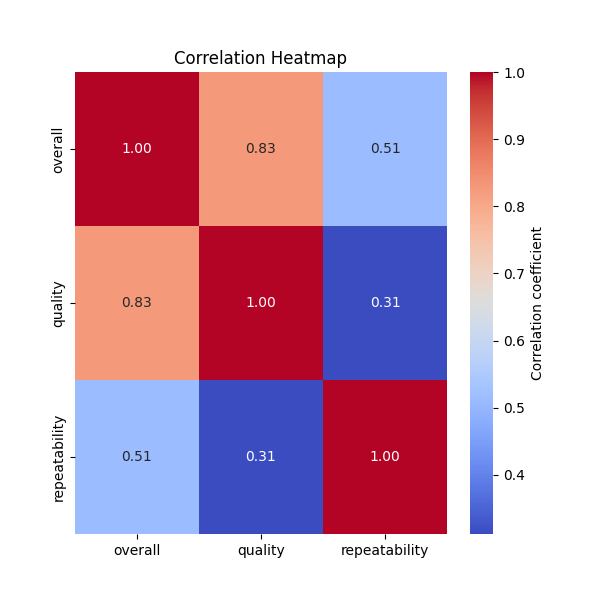

### Comprehensive Analysis of Data Insights

#### Summary Statistics

1. **Date Analysis**:
   - The dataset contains a total of 2,553 entries with 2,055 unique dates. The most frequently occurring date is '21-May-06', which appears 8 times. This suggests that there may be some significant event or phenomenon recorded on this date worth investigating further.
  
2. **Language**:
   - There are 2,652 records with the most frequent language being English (1,306 occurrences). This indicates a strong preference or bias towards English in the dataset, which could reflect audience or data collection styles. 

3. **Type Distribution**:
   - The majority of entries (2,211) pertain to the 'movie' type category, indicating this dataset predominantly focuses on film-related content. Analysis opportunities may include examining the impact of varying movie genres.

4. **Title Insights**:
   - There are 2,312 unique titles, with 'Kanda Naal Mudhal' as the most frequent title (9 times). This could suggest a popular trend or a need for more diversified data regarding film titles.

5. **Contributor Analysis**:
   - The contributor ('by') field has 2,390 records with 1,528 unique contributors, the most prolific being Kiefer Sutherland (48 occurrences). Understanding the role and influence of key contributors could present further analytical opportunities.

6. **Rating Metrics**:
   - **Overall Rating**: Mean of approximately 3.05 and a standard deviation of 0.76, indicating moderate satisfaction. 
   - **Quality Rating**: Mean of approximately 3.21, suggesting that quality ratings slightly skew higher than overall ratings.
   - **Repeatability**: A mean of about 1.49 suggests that many entries are not frequently revisited or referenced, implying limited engagement with the content.

#### Missing Values

- The dataset shows noticeable missing values:
  - 99 missing dates (approximately 3.73%).
  - 262 missing contributors (‘by’) amounting to around 9.85% of entries.
  
Addressing these missing values is crucial for thorough analyses. Possible actions include:
- **Imputation**: Filling missing values for 'date' and 'by' by leveraging available data.
- **Exclusion**: Conducting analyses that exclude missing data if they don’t significantly impact results.

#### Correlation Analysis

- The correlation matrices reveal some interesting relationships:
  - **Strong correlation between overall and quality ratings (0.83)** indicates that as the quality increases, overall satisfaction tends to increase as well.
  - **Moderate correlation between overall and repeatability (0.51)** suggests that higher-rated entries are somewhat more likely to be referenced again.
  
These correlations provide actionable insights:
- Improve low-rated films to boost overall ratings and repeat the improvements on higher-rated films.
- Investigate how quality impacts repeatability and potentially create a marketing strategy to enhance films' ratings and engagement metrics.

#### Visualizations

The created visualizations provide a good foundation for interpreting these insights:
- Distribution graphs of overall ratings, quality ratings, and repeatability can visually indicate patterns, outlier detection, and public reception.
- The correlation heatmap can help visualize and better understand relationships among variables.

### Actionable Insights

1. **Follow-Up Analysis on 'Kanda Naal Mudhal'**: Since it's the most frequent title, deeper analysis could yield insights into its popularity, including thematic trends or specific audience demographics. 
   
2. **Data Cleaning**: Ensure the integrity of the dataset by addressing missing values, especially focusing on the contributor field which has a significant number of missing entries.

3. **Timing and Frequency**: Investigate the reason behind the peak of entries on '21-May-06'. Understanding why specific dates had more entries could provide insights into cultural trends or events.

4. **Emphasis on Quality Improvements**: Companies or individuals involved with the titles in the dataset should focus on enhancing film quality to leverage the observed correlation between quality and overall satisfaction.

5. **Diversity in Language**: While the dataset reflects a strong English bias, considering incorporating diverse language data could appeal to broader audiences and enhance engagement over time.

6. **Leverage Contributors**: Engage the top contributors like Kiefer Sutherland more effectively in marketing strategies or seek partnerships for discussions, screenings, or events to potentially lift collective audience scores.

By implementing these insights and analyses, a more robust understanding of the dataset can be established, leading to informed decision-making and strategic planning in film production and analysis.

